# Luiz Gonzaga Sá Neto | Full Stack Developer

Luiz Gonzaga Sá Neto, 30 anos, Fortalezense, administrador de formação (UNIFOR) e Desenvolvedor Full Stack por paixão.

🏦 6 anos no Itaú (como Gerente PJ), onde entendi como tecnologia transforma negócios

💻 Migrei para TI em 2024, buscando unir minha experiência em gestão com habilidades técnicas

🌎 Inglês fluente – consigo colaborar em projetos globais e absorver conteúdos internacionais

🎮 Criador do [Keeg Club](https://wwww.keegclub.com.br) – blog onde exploro cultura geek (e treino minha criatividade para resolver bugs!)

 
  
  
   

---

## 🛠 Tech Stack

**Front-end:**  

**Back-end:**  

**Database:**  

**Tools:**  

---

## 🚀 Minha Jornada

```mermaid
graph LR
    A[2016-2022: Gerente PJ no Itaú] --> B[2024: Migração para TI]
    B --> C[Formação Full Stack<br>Infinity School]
    C --> D[🚀 Busca por Oportunidades]
```

---

## 📊 GitHub Stats  

<a href="httpa://github.com/LuizGSN">

  
---

<picture>
  <source media="(prefers-color-scheme: dark)" srcset="https://raw.githubusercontent.com/LuizGSN/LuizGSN/output/github-contribution-grid-snake-dark.svg">
  <source media="(prefers-color-scheme: light)" srcset="https://raw.githubusercontent.com/LuizGSN/LuizGSN/output/github-contribution-grid-snake.svg">
  
</picture>
